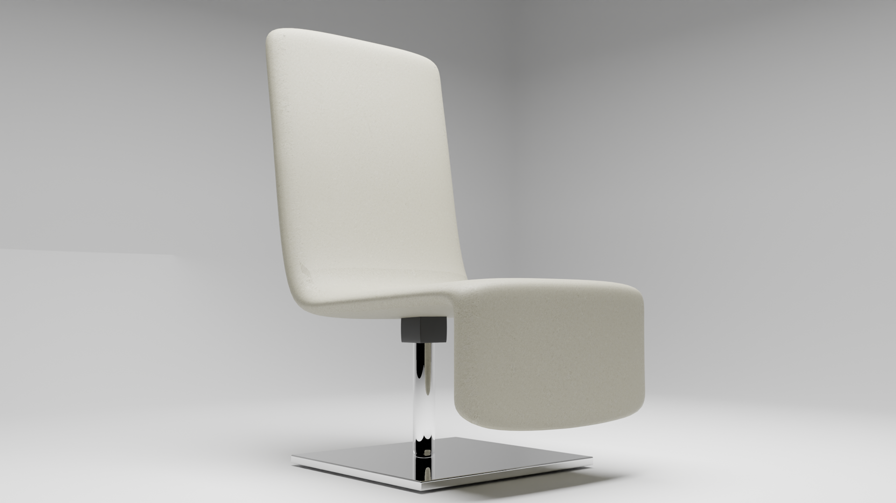

# Designer Chair - Blender 3D Model

## Overview

This repository contains a 3D model of a designer chair created using Blender. The chair combines modern design aesthetics with ergonomic comfort, making it suitable for various applications including interior design, architectural visualization, and product presentations.

## Project Description

The Designer Chair model is a high-quality 3D asset designed with a focus on both aesthetics and functionality. It features a sleek, modern design with ergonomic contours, making it an ideal choice for contemporary interior settings.

## Model Features

- **Ergonomic Design**: Contoured to provide optimal comfort and support.
- **Modern Aesthetics**: Clean lines and minimalist design to suit modern interiors.
- **High-Quality Textures**: Realistic textures for materials such as wood, metal, and upholstery.
- **Attention to Detail**: Detailed modeling of all components including seat, backrest, and legs.
- **Customizable**: Easy to modify materials, colors, and textures to fit different design requirements.

## Technical Details

- **Polycount**: Optimized for high-quality renders while maintaining performance.
- **Textures**: High-resolution textures included for realistic rendering.
- **Materials**: PBR (Physically Based Rendering) materials for accurate lighting and shading.
